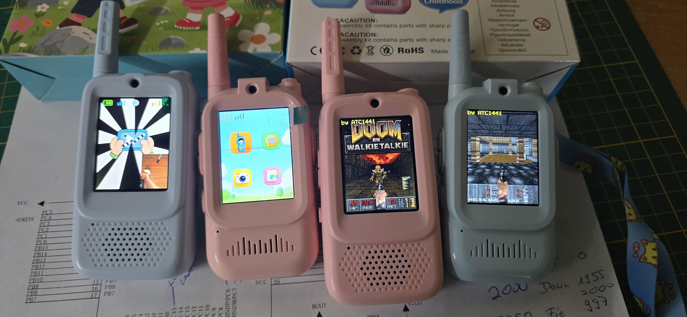
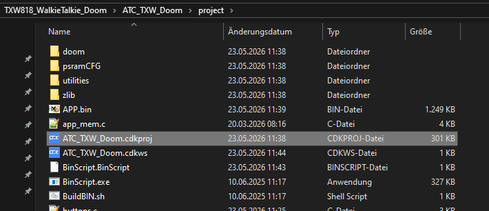
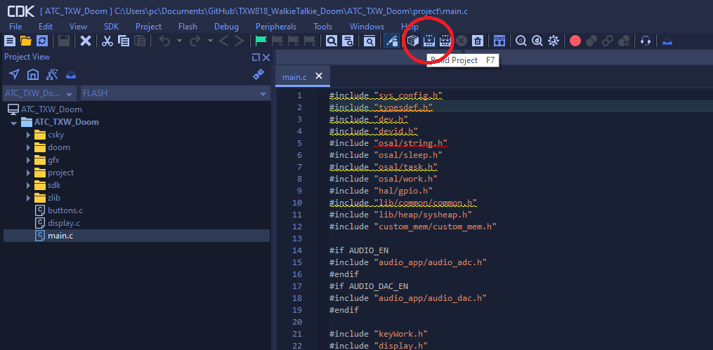
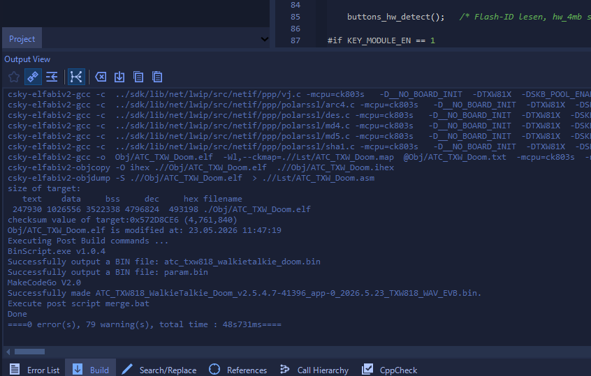
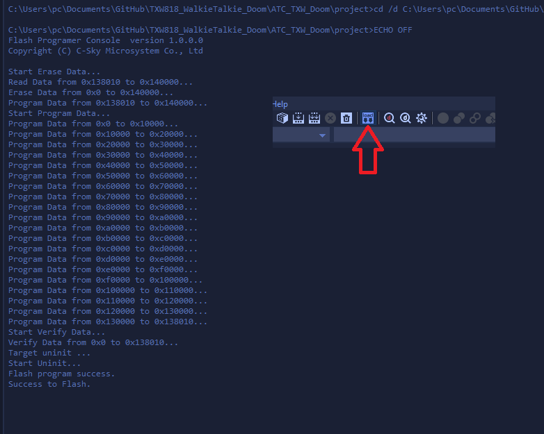

# TXW818 WalkieTalkie Doom

<!-- VIDEO PLACEHOLDER - replace the image and link once the video is published -->
<!--

-->

Doom running on cheap Chinese walkie-talkies powered by the **TXW818 SoC** (C-Sky architecture, 240 MHz).
These devices come with 2 MB or 4 MB of SPI Flash and an internal 4 MB PSRAM - just enough to squeeze in a
compressed Doom.wad and play a full round of the classic first-person shooter on the built-in 240×320 LCD.

---

This repo is made together with this explanation video:(click on it)

## Hardware

| Component | Details |
|-----------|---------|
| SoC | TXW818 (C-Sky RISC, 240 MHz) |
| Flash | 2 MB or 4 MB SPI NOR (auto-detected at boot) |
| PSRAM | 4 MB internal (2.2 MB heap, 1.5 MB for Doom game data) |
| Display | 240×320 RGB565 LCD (NV3031A driver) |
| Input | 3-button ADC resistor ladder on PA\_3 (UP / DOWN / PRESS) |
| Audio | On-chip DAC, OPL-based FM sound synthesis |

The firmware auto-detects 2 MB vs 4 MB hardware at boot and adjusts the ADC button thresholds accordingly.

---

## Doom port

The engine is adapted from **[esp32c3-doom-bauble](https://github.com/Spritetm/esp32c3-doom-bauble)**
by Spritetm - a Doom port targeting the ESP32-C3 - which is itself derived from **GBA Doom**
(a port of [PrBoom](https://prboom.sourceforge.net/) 2.5.0).
Fixed-point math helpers originate from the Jaguar Doom port.

The bundled WAD is a **custom stripped-down version of the Doom 1 Shareware WAD**:
only Episode 1 Map 1 (E1M1) is included, and a number of graphics lumps (intermission screens,
menu graphics, unused patches) have been removed to fit the data inside the available Flash.
The WAD is compiled directly into the firmware as a gzip-compressed C byte array
(`doom_iwad_gz.c`, auto-generated from `smaller_doom.bin.gz`) and decompressed into PSRAM at
startup - no SD card or external storage is required.

---

## Building

1. **Extract the CDK IDE** - unpack `cdk-windows-V2.24.5-20250108-1536.zip` anywhere on your PC. Get it from here: https://occ-oss-prod.oss-cn-hangzhou.aliyuncs.com/resource//1736405165640/cdk-windows-V2.24.5-20250108-1536.zip

2. **Open the project** - launch the CDK IDE and open the project file
   `ATC_TXW_Doom/ATC_TXW_Doom.cdkproj`.

   

3. **Compile** - click *Build* (or press F7, circled in the toolbar screenshot below).

   

   A successful build ends with `0 error(s)` and produces the output binaries:

   

4. **Output binary** - after a successful build the ready-to-flash image is located at
   `ATC_TXW_Doom/atc_txw818_walkietalkie_doom.bin`.

---

## Flashing

Flashing requires a **BluePill-based flash adapter**.
Build the adapter as described in the manual:

> **https://www.elektroda.com/rtvforum/topic4120455.html**

Once the adapter is ready:

1. Connect the walkie-talkie to the adapter according to the pinout shown in the manual.

2. **First-time flash only - bridge the external Flash IO pins.**
   When flashing over an unmodified stock firmware the SoC may boot into the existing firmware
   before the flasher can take control. To prevent this, bridge the IO2 and IO3 pins of the
   external SPI Flash chip together while powering on the device. This holds the Flash in a
   non-executable state so the SoC stays in its built-in ROM boot/download mode.
   **Remove the bridge immediately after power-up** - leaving it in place will prevent flashing
   from working.

3. Open `ATC_TXW_Doom/CSKYFlashProgramerConsole.bat` (or use the CDK built-in flash tool).
4. Select `atc_txw818_walkietalkie_doom.bin` as the target image and flash it to address `0x0`.

   

---

## License

This project is a combination of multiple independent works. Each part remains under its original
license and belongs to its respective author(s):

- **Doom engine / PrBoom 2.5.0** - © id Software, © Colin Phipps et al., GNU GPL v2
- **GBA Doom port** - © Killough, Calum Lewis and contributors, GNU GPL v2
- **esp32c3-doom-bauble** - © Spritetm, https://github.com/Spritetm/esp32c3-doom-bauble
- **Jaguar Doom math helpers** - © id Software / Arc0re, see `gba_functions.h`
- **TXW818 SDK and libraries** - © the respective SDK vendor; pre-built blobs are included as-is
- **Glue code and HAL adaptations** (display, buttons, main) - released without additional
  restrictions alongside this repository

No authorship or credit is claimed for any of the upstream components.
All trademarks (including *Doom*) belong to their respective owners.
